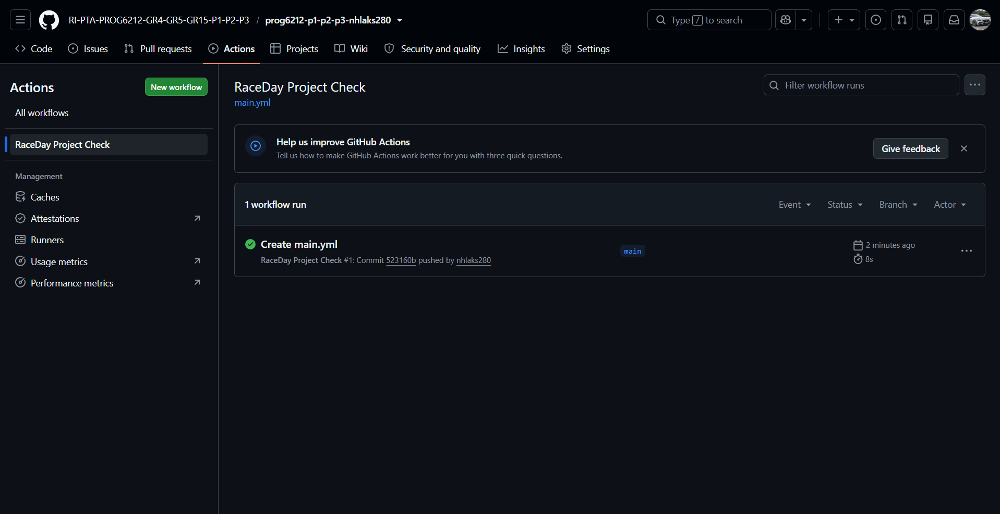

## RaceDay System

RaceDay is an event management system designed to manage running events, event categories, participant enrolments and race results.

### Part 1 – System Planning and Database

This section contains the system planning and database design for the RaceDay system.

### Documentation

- [ERD](docs/RaceDay_ERD.drawio.png)
- [API Endpoint Plan](docs/API_Endpoint_Plan.md)
- [SQL Database Script](docs/RaceDay_Database.sql)

### Database

The database is implemented using Microsoft SQL Server and includes:

- Users
- Events
- Categories
- Event Categories
- Enrolments
- Results

The database script includes primary keys, foreign keys, constraints and sample data.

### Roles

The system supports two user roles:

- Organiser
- Participant

### GitHub Actions

The project includes a GitHub Actions workflow that checks that all required Part 1 files are present.

